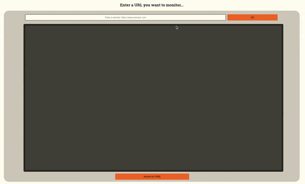
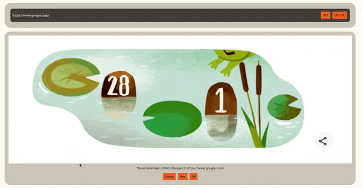

# Web Page Monitor :zap::mag:

**Web Page Monitor** is a web application built with Vue.js, Node.js, Express, and SQLite, designed for monitoring web pages.

## Features
- **Monitor Dynamic Pages**: Track changes on dynamic web pages by utilizing screenshots.
- **Intuitive Selection UI**: Easily select specific areas of web pages to monitor for changes.
- **Manage List of Tasks**: Maintain a list of URLs to monitor and manage them easily.
- **Visual Results**: View monitoring results visually by seeing comparisons between original and updated versions of web pages.

## Usage
1) **View a Website**: Navigate to the URL of the website you want to monitor.
3) **Select Area to Monitor**: Use the application's cropping interface to specify the area of the website you want to monitor for changes.
4) **Add a Task**: Click the "Monitor" button to add the current website section as a monitoring task.
5) **Delete a Task**: Click on the "Delete" button associated with the task.
6) **Viewing Results**: Click on the "Get" button associate with the task.

## Development
To contribute to the development of Web Page Monitor, follow these steps:

1) Fork the repository.
2) Clone your fork: `git clone https://github.com/your-username/web-page-monitor.git`
3) Start development environment: `npm start`
4) Commit your changes: `git commit -m "Your message here"`
5) Push to your fork: `git push origin main`
6) Submit a pull request.

## Deploy with Docker

1) Run `npm run start-container` to build and deploy docker image.
2) Navigate to [https://localhost:8080](https://localhost:8080) to access the application.

## License
This project is licensed under the [MIT License](LICENSE).
